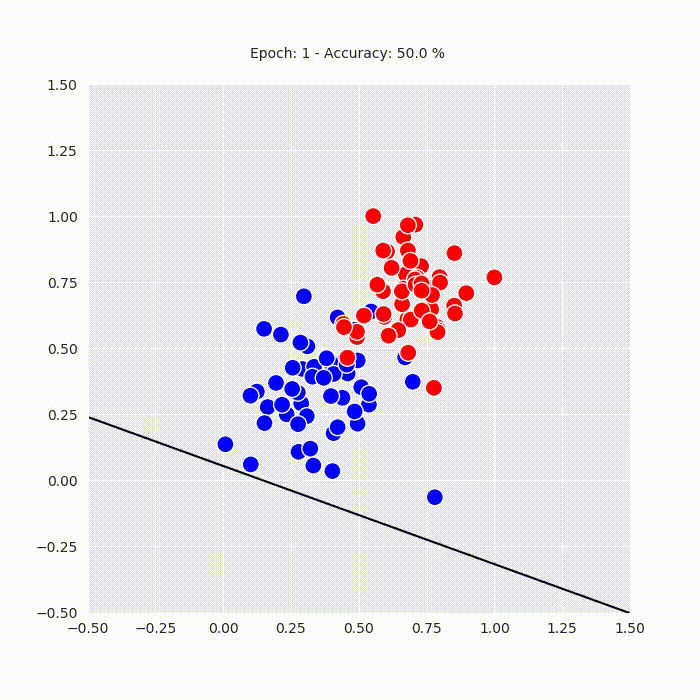

# Repository for Prototypes and Experimental Projects

## Contents

- [Neural Networks](nn)
  - [Animated perceptron training process with matplotlib](nn/animated_perceptron.ipynb)
  - [Neural Network in numpy from scratch notebook](nn/nn_from_scratch.ipynb)
  - [RNN in PyTorch notebook](nn/rnn_pytorch.ipynb)
- [networkx](networkx)
  - [networkx tutorial notebook](networkx/tutorial.ipynb)
- [node2vec](node2vec)
  - [Lab notebook 0](node2vec/lab_0.ipynb)
- [autograd.numpy](autograd_np)
  - [Lab notebook](autograd_np/autograd_lab.ipynb)
- [LaTeX](latex)
- [Misc](misc)

**Animated Perceptron** | [notebook](nn/animated_perceptron.ipynb)

